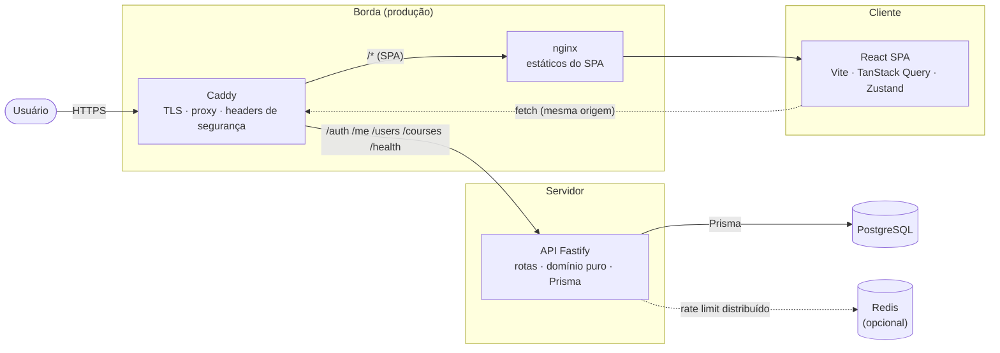
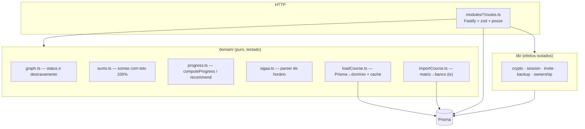
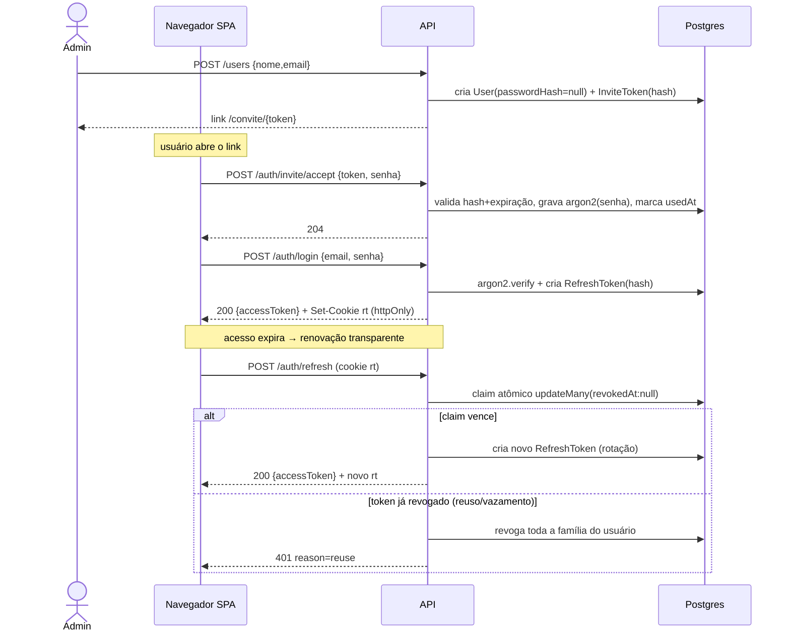
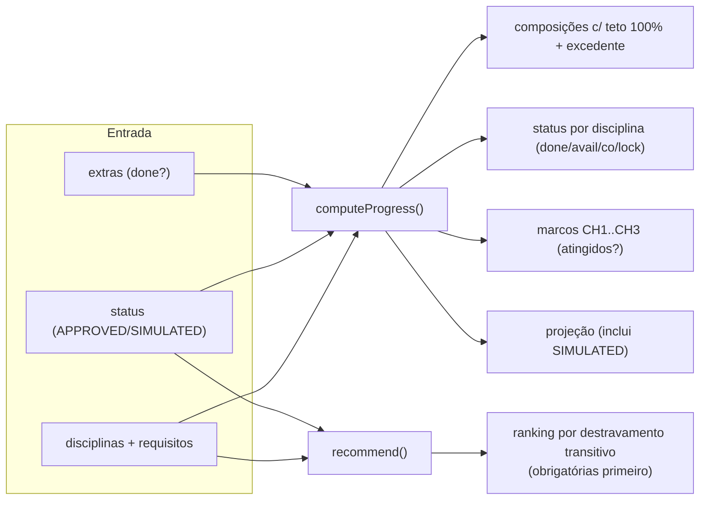
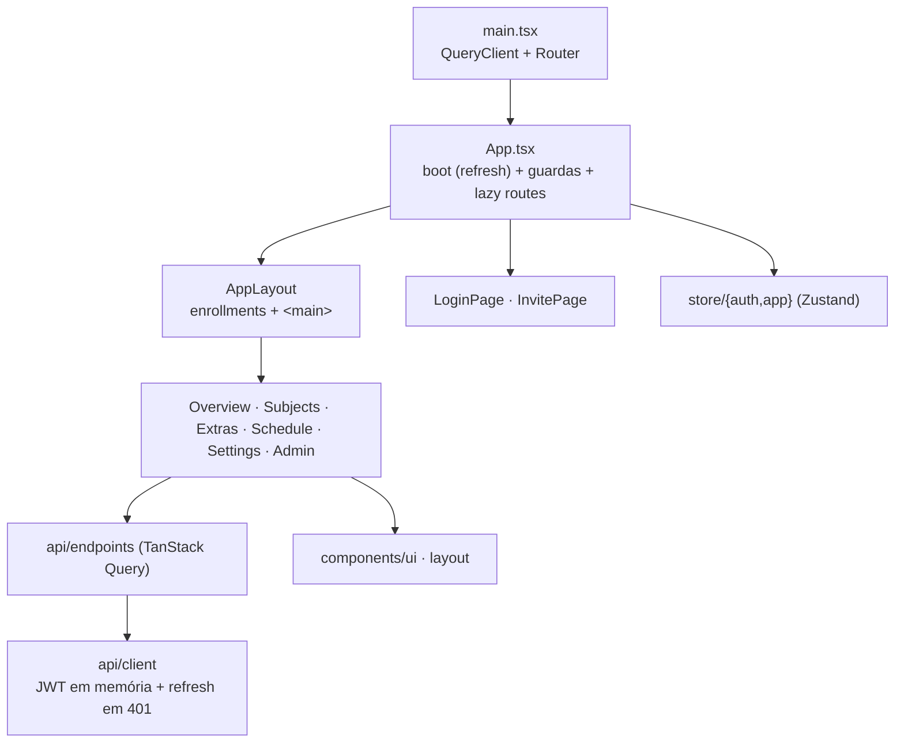

# Arquitetura — Painel Acadêmico

Documento de arquitetura com diagramas, decisões de projeto e o mapa de camadas. Complementado por
[`API.md`](API.md) (contrato de endpoints com exemplos) e [`MODULOS.md`](MODULOS.md) (referência
arquivo a arquivo / função a função). Requisitos em [`../ESPECIFICACAO.md`](../ESPECIFICACAO.md).

---

## 1. Visão geral

O Painel Acadêmico acompanha a integralização de matrizes curriculares: calcula o status de cada
disciplina a partir do grafo de pré/co-requisitos e marcos de horas, recomenda disciplinas pelo impacto
de destravamento, registra componentes fora da matriz e monta cenários de cronograma. É multiusuário,
com papéis ADMIN/USER, e escalável para múltiplos cursos.

A regra de ouro do projeto: **o cliente é conveniência; todo cálculo que concede algo (posse, papel,
status, validação de código SIGAA) é reexecutado no servidor**.

## 2. Componentes e topologia

- **Mesma origem**: o Caddy roteia as rotas de API para o backend e todo o resto para o SPA. Assim o
  cookie de refresh (`path=/auth`) casa e não há CORS em produção.
- **Dev**: SPA em `:5173` (Vite) e API em `:3333` (Fastify) com CORS restrito; Postgres em Docker.
- **Redis é opcional**: sem `REDIS_URL` o rate limit é em memória (suficiente para 1 réplica).

## 3. Ciclo de vida de uma requisição

Toda rota autenticada passa pela mesma cadeia de guardas antes do handler:

O `setErrorHandler` central mapeia `ZodError→400`, `OwnershipError→403/404`, `SigaaError→400`,
erros conhecidos do Prisma (`P2002→409`, `P2025→404`) e o resto para `500` genérico (RNF-04).

## 4. Camadas do backend

O backend separa **lógica de domínio pura** (testável sem banco) de **efeitos** (rotas HTTP e acesso a
dados). Essa é a decisão estrutural mais importante — o servidor é a fonte de verdade dos cálculos.

- `domain/graph.ts`, `sums.ts`, `sigaa.ts`, `progress.ts` **não importam Prisma nem HTTP** — recebem
  formas simples e são cobertos por testes unitários rápidos.
- `loadCourse.ts` é a ponte Prisma→domínio (com cache em memória por curso, TTL 5 min).
- `lib/*` concentra os efeitos com segredo (hash de tokens, rotação de refresh, backup).

## 5. Fluxo de autenticação (RF-01..04)

Access token JWT curto (~15 min) no header `Authorization`; refresh opaco, rotativo, em cookie
`httpOnly`. Só o **hash** dos tokens é persistido (RNF-01).

O "claim" atômico (`updateMany where revokedAt=null`) garante que sob dois refresh concorrentes com o
mesmo token apenas **um** vença — fechando a corrida de rotação e a proliferação de tokens.

## 6. Modelo de dados (14 entidades)

Modelar composições (NC/NEO/OPT/NL/AC) e marcos (CH1..CH3) como **linhas** — não colunas fixas — é o
que permite cursos com estruturas diferentes (RF-13). Requisitos apontam para uma disciplina (por id) ou
para uma `milestoneKey` (requisito por horas). Índices em todas as FKs consultadas (ver `MODULOS.md`).

## 7. Cálculo de progresso (RF-05/06/07)

O coração do produto. Dado o grafo do curso e os status do aluno:

- **Teto em 100% com excedente registrado** (RF-05): as barras travam em 100%, mas o valor real é
  preservado e exibido como "+Xh além do mínimo".
- **Oficial × simulado** (RF-06): `APPROVED` conta no oficial; `SIMULATED` só na projeção.
- **Recomendações** (RF-07): para cada disciplina disponível, conta quantas outras ela destrava
  transitivamente no grafo, priorizando obrigatórias.

## 8. Estrutura do frontend

- **Sessão**: access token em memória (`api/client.ts`); refresh transparente uma vez em qualquer 401.
- **Estado de servidor**: TanStack Query (cache por `queryKey`, invalidação nas mutações).
- **Estado de UI**: Zustand (`auth` = usuário/status; `app` = enrollment selecionado).
- **Code-splitting**: cada página autenticada é um chunk (`React.lazy`).
- **Tema**: `html[data-theme]` alternado e persistido por usuário (RF-15).

## 9. Decisões de projeto (resumo)

| Decisão | Porquê |
| --- | --- |
| Domínio puro separado das rotas | Servidor como fonte de verdade; testes rápidos sem banco; espelha `frontend/src/lib`. |
| Refresh rotativo + detecção de reuso | Sessão longa segura; vazamento de cookie é detectado e revoga a família. |
| Composições/marcos como linhas | Multi-curso (RF-13) sem alterar schema por curso. |
| Cache do grafo por curso | Matriz é imutável entre importações; evita recarregar ~10² linhas por request. |
| Cookie `httpOnly` + JWT em memória | Access token não fica em `localStorage` (mitiga XSS); refresh não é acessível por JS. |
| Backup portável por `seq` | Sobrevive a re-seed/reimportação da matriz (ids mudam, `seq` não). |

## 10. Operação

`docker-compose.yml` sobe `db + api + web + caddy`. A API aplica migrações no boot
(`prisma migrate deploy`), roda como usuário não-root e encerra graciosamente em `SIGTERM`. Ver
[`PROGRESSO.md`](PROGRESSO.md) e [`REVISAO.md`](REVISAO.md) para estado, verificações e backlog.
